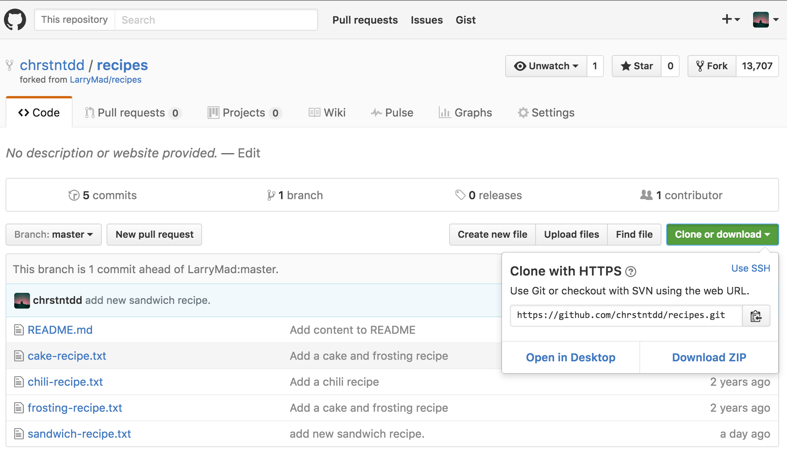

## Describe the differences between forks, clones, and branches. When would you use one instead of another?

Cloning a repository is a common practice in the world of web development. This action will, for lack of a better word, clone/copy an existing remote repository onto your local machine and bring down all the files associated. Merely cloning a repo **will not** retain any ties to the original creator of the repository, so if that is important, forking the repo and then cloning it would be a more optimal solution.

Forking a repository can only be done on Github.com. This function will copy a repository form one users profile onto anothers without cloning the files onto your machine. This lets the user who forked the repo to have their own remote of the repository under their profile on Github while also keeping ties to the creator of said repository. In order to actually pull down all the files from this fork, the repository will have to be cloned with Git using the web URL that is associated with the newly forked repository.

Branches are another feature of Git that afford the user to be more adventurous with ideas. All git repositories have at least one branch known as the master branch. This branch serves as the working branch where all changes that get committed to master wont break the basic functions that the repository serves. Experimental changes and new features can be implemented on separate branches from the master so that any alterations don't adversely affect the operational master branch.